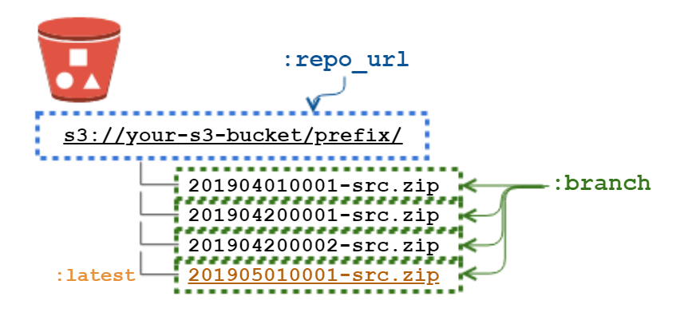
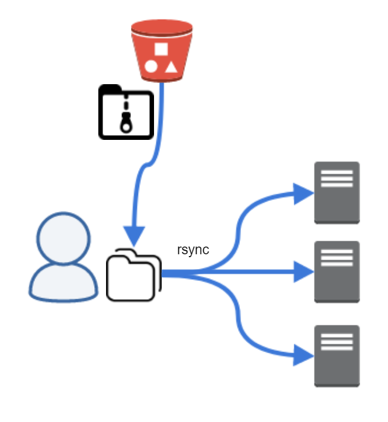
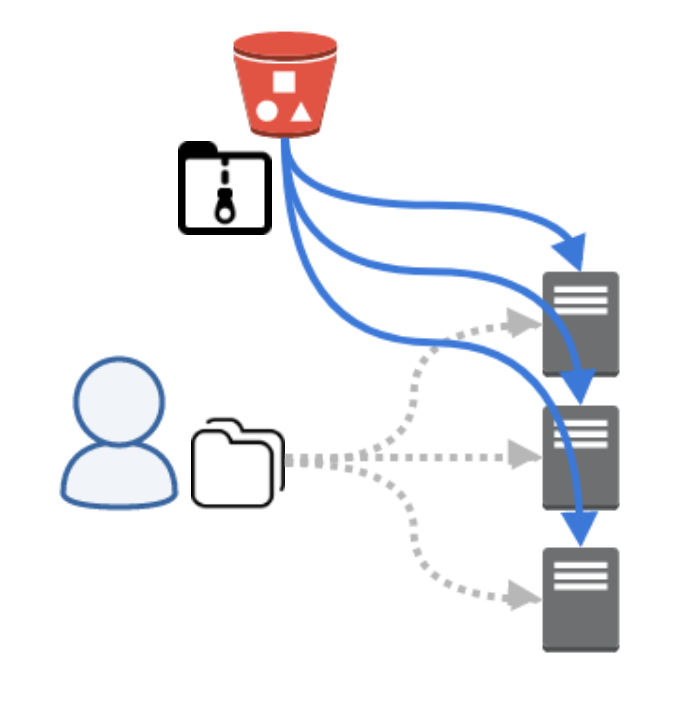

# Capistrano::S3Archive

Capistrano::S3Archive is the `SCM` extention of [Capistrano](http://www.capistranorb.com/).

**CAUTION!!** Document for VERSION < 0.9 is [legacy_README](legacy_README.md)

This `SCM` treats your S3 bucket as a source repository, and maps the uploaded ZIP/TAR archive file to a `branch` in Capistrano.



And this makes it possible to separate the deployment process into "pre-build" and "distribution", and helps to shorten the time of distribution and simplify the management of access rights. For example, you can prepare a zip file that has already done `npm install`, and an other, you can set up an EC2 IAM profile that allowed to read S3 instead of putting access keys for your private Git repository on the remote hosts.

## Installation

Add this line to your application's Gemfile:

```ruby
gem 'capistrano-s3_archive', '~> 1.0'
```

And then execute:

    $ bundle

<!-- Or install it yourself as: -->

<!--     $ gem install capistrano-s3_archive -->


### Quick Start

In Capfile:

    require "capistrano/scm/s3_archive"
    install_plugin Capistrano::SCM::S3Archive


And set a S3 path containing source archives to `:repo_url` and the parameters to access Amazon S3 to `:s3_archive_client_options`, For example, if you has following tree,

    s3://yourbucket/somedirectory/
                      |- 201506011200.zip
                      |- 201506011500.zip
                      ...
                      |- 201506020100.zip
                      `- 201506030100.zip

then your `config/deploy.rb` would be:

    set :repo_url, 's3://yourbucket/somedirectory/'
    set :s3_archive_client_options, { region: 'ap-northeast-1', credentials: somecredentials }


To deploy staging:

```
$ bundle exec cap staging deploy
```

## Usage
### Set strategy
Choose a strategy for deploying extracted code to the remote from the archive.
- rsync
- direct

such as `set :s3_archive_strategy, :direct`.


#### strategy `rsync` (default)


This strategy behaves like the [capistrano-rsync](https://github.com/moll/capistrano-rsync) except downloading sources from S3 instead of GIT by default.

#### strategy `direct`



### Requirements

| For `rsync` strategy  | local | remotes |
| :-                    | :-:   | :-:     |
| rsync                 | ✔     | ✔       |
| unzip or tar          | ✔     | -       |
| awscli                | -     | -       |
| s3:ListBucket         | ✔     | -       |
| s3:ListBucketVersions | ✔     | -       |
| s3:GetObjectVersion   | ✔     | -       |
| s3:GetObject          | ✔     | -       |


| For `direct` strategy     | local | remotes |
| :-                        | :-:   | :-:     |
| rsync                     | -     | -       |
| unzip or tar              | -     | ✔       |
| awscli                    | -     | ✔       |
| awscli configuration (*1) | -     | ✔       |
| s3:ListBucket             | ✔     | ✔       |
| s3:ListBucketVersions     | ✔     | ✔       |
| s3:GetObjectVersion       | -     | ✔       |
| s3:GetObject              | -     | ✔       |

_(*1) awscli on remote hosts need to have access rights to S3 by default settings._


### Configuration

Available configurations are followings (key, default).

    # COMMON SETTINGS
    :repo_url, nil
    :branch, :latest
    :s3_archive_client_options, {}
    :s3_archive_sort_proc, ->(new, old) { old.key <=> new.key }
    :s3_archive_strategy, :rsync
    :s3_archive_object_version_id, nil


**`repo_url` (required)**

The S3 bucket and prefix where the archives are stored. e.g. 's3://yourbucket/somedirectory/'.

**`branch`**

Basename of archive object to deploy. In the previous example at Quick Start section, you can use `'201506011500.zip'`, `'201506020100.zip'`, etc. And `:latest` is a special symbol to select latest object automatically by `:s3_archive_sort_proc`.

**`s3_archive_client_options` (required)**

Options passed to `Aws::S3::Client.new(options)` to fetch archives.

**`s3_archive_sort_proc`**

Sort algorithm used to detect basename of `:latest` object. It should be proc object for `new,old` as `Aws::S3::Object` comparing.

**`:s3_archive_strategy, :rsync`**

A Strategy to distribute archived source code. You can set `:rsync` or `direct`.

**`:s3_archive_object_version_id`**

Version ID of version-controlled S3 object. It should use with `:branch`. e.g. `set :branch, 'myapp.zip'; set :version_id, 'qawsedrftgyhujikolq'`

#### Configurations for `rsync` strategy

    :s3_archive_skip_download, nil
    :s3_archive_local_download_dir, "tmp/archives"
    :s3_archive_local_cache_dir, "tmp/deploy"
    :s3_archive_remote_rsync_options, ['-az', '--delete']
    :s3_archive_remote_rsync_ssh_options, []
    :s3_archive_remote_rsync_runner_options, {}
    :s3_archive_rsync_cache_dir, "shared/deploy"
    :s3_archive_hardlink_release, false

**`:s3_archive_skip_download`**

If this set to true, skip downloading the archive and rsync from local cache.

**`:s3_archive_local_download_dir`**

Path where to download source archives. Can use both relative or absolute.

**`:s3_archive_local_cache_dir`**

Path where to extruct your archive on local for staging and rsyncing. Can use both relative or absolute.

**`:s3_archive_remote_rsync_options`**

Options used to rsync to remote cache dir.

**`:s3_archive_remote_rsync_ssh_options`**

Options used in `rsync -e 'ssh OPTIONS'`.

**`:s3_archive_remote_rsync_runner_options`**

Runner options of a task to rsync to remote cache, this options are passed to `on release_roles(:all), options` in the rsyncing task. It's useful when to reduce the overload of the machine running Capistrano. e.g. `set :s3_archive_remote_rsync_runner_options, { in: :groups, limit: 10 }`.

**`:s3_archive_rsync_cache_dir`**

Path where to cache your sources on the remote server to avoid rsyncing from scratch each time. Can use both relative or absolute from `deploy_to` path.

**`:s3_archive_hardlink_release`**

Enable `--link-dest` option when creating release directory by remote rsyncing. It could speed deployment up.

#### Configurations for `direct` strategy

    :s3_archive_remote_cache_dir, -> { File.join(shared_path, "archives") } # 典型的には,


## Development

After checking out the repo, run `bin/setup` to install dependencies. Then, run `bin/console` for an interactive prompt that will allow you to experiment.

To install this gem onto your local machine, run `bundle exec rake install`. To release a new version, update the version number in `version.rb`, and then run `bundle exec rake release` to create a git tag for the version, push git commits and tags, and push the `.gem` file to [rubygems.org](https://rubygems.org).

## Contributing

1. Fork it ( https://github.com/[my-github-username]/capistrano-s3_archive/fork )
2. Create your feature branch (`git checkout -b my-new-feature`)
3. Commit your changes (`git commit -am 'Add some feature'`)
4. Push to the branch (`git push origin my-new-feature`)
5. Create a new Pull Request
